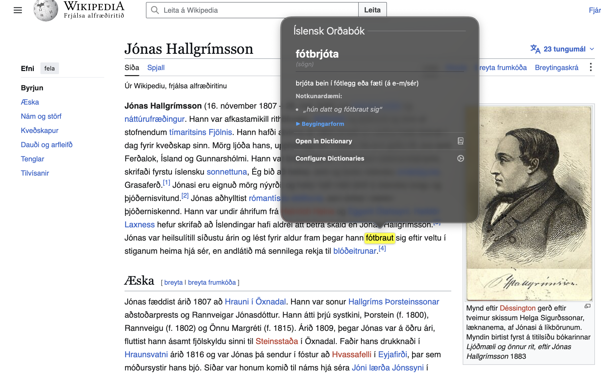
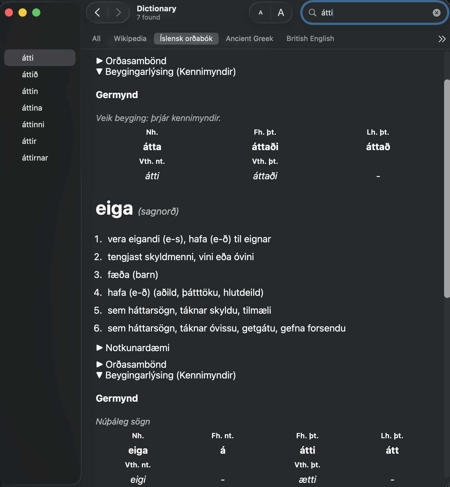

# macOS Icelandic Dictionary Builder




Bring seamless, system-wide Icelandic definitions to your Mac! 

This project compiles source lexical data (INO) and morphology (BÍN) into a local Apple Dictionary bundle so lookup works with inflected forms.

## Important License Context

The lexical source data used by this builder is subject to a NoDerivatives license (CC BY-NC-ND 4.0).

What that means in practice:
- You should build locally for private/personal use.
- You should not redistribute compiled dictionary bundles generated from the licensed data.
- You should not publish modified source data dumps from the licensed dataset.
- Always keep attribution and source references.

Because the "NoDerivatives" (ND) clause strictly forbids the distribution of modified or converted versions of the data, **pre-compiled `.dictionary` files cannot legally be hosted here for download.** Instead, this project is an automated, open-source tool allowing you to compile the dictionary privately on your own Mac for your personal use.

Read LICENSE in this repository for a project-specific summary and links.

## Project Structure (Consolidated)

- scripts/build_dict.py: Main build pipeline (parse INO XML, enrich with BÍN morphology, emit Apple XML).
- scripts/install_dictionary.sh: One-command installer for new users.
- data/ino_data.xml: Local lexical source data input.
- src/IcelandicDictionary.xml: Generated dictionary source XML (build output).
- src/IcelandicDictionary.css: Dictionary style sheet used by build_dict.sh.
- src/IcelandicDictionary.plist: Bundle metadata (includes display name: "Íslensk orðabók").
- src/Makefile: Primary build/install targets for DictionaryDevelopmentKit.
- src/objects/: Intermediate and final .dictionary build artifacts.
- Makefile: Thin root shim that forwards to src/Makefile.

## Prerequisites

1. macOS with Xcode Additional Tools installed.
2. DictionaryDevelopmentKit available at:
   /Applications/XcodeAdditionalTools/Utilities/DictionaryDevelopmentKit
3. Python virtual environment with required Python package:
   - islenska

### Important: Remove Spaces From The Xcode Tools Folder Name

If your download is in the default folder named `Additional Tools for Xcode`, rename it so paths contain no spaces.

Run:

```bash
sudo mv "/Applications/Additional Tools for Xcode" "/Applications/XcodeAdditionalTools"
```

After renaming, this file should exist:

```text
/Applications/XcodeAdditionalTools/Utilities/DictionaryDevelopmentKit/bin/build_dict.sh
```

## Setup

From repository root:

```bash
python3 -m venv .venv
source .venv/bin/activate
pip install islenska
```

## Build

Generate the dictionary XML:

```bash
source .venv/bin/activate
python scripts/build_dict.py
```

Expected output includes:
- Parsing INO entries
- Morphology integration
- Generated src/IcelandicDictionary.xml

## Install into Dictionary.app

Beginner one-command path:

```bash
./scripts/install_dictionary.sh
```

Manual path:

Build and install bundle:

```bash
make install
```

This compiles and copies:
- src/objects/IcelandicDictionary.dictionary
into:
- ~/Library/Dictionaries/

Then:
1. Open Dictionary.app.
2. Open Settings.
3. Enable the installed Icelandic dictionary.
4. Restart Dictionary.app if it was already open.

## Update Workflow

When source data or morphology logic changes:

```bash
source .venv/bin/activate
python scripts/build_dict.py
make install
```

## Notes on Lookup Behavior

- Inflected lookup is powered by BÍN-based index enrichment.
- Verb paradigms include class-sensitive layouts (for example núþálegar and selected ri-verbs).
- Nouns and adjectives render dedicated declension tables.

## Troubleshooting

- If build fails with "No module named islenska":
  - run: `source .venv/bin/activate && pip install islenska`
- If `build_dict.sh` is not found:
  - verify this path exists:
    `/Applications/XcodeAdditionalTools/Utilities/DictionaryDevelopmentKit/bin/build_dict.sh`
  - if you see `/Applications/Additional Tools for Xcode`, rename it with:
    `sudo mv "/Applications/Additional Tools for Xcode" "/Applications/XcodeAdditionalTools"`
  - then re-run `make install`.
- If `./scripts/install_dictionary.sh` says permission denied:
  - run: `chmod +x scripts/install_dictionary.sh`
- If Dictionary.app does not show updates:
  - run: `make install`
  - confirm "IcelandicDictionary.dictionary" exists in `~/Library/Dictionaries/`
  - ensure the dictionary is enabled in Dictionary.app Settings
  - restart Dictionary.app
- If lookups seem stale:
  - run:
    `rm -rf ~/Library/Dictionaries/IcelandicDictionary.dictionary && make install`

## Attribution

- Lexical source data: Stofnun Árna Magnússonar í íslenskum fræðum via CLARIN Iceland (see source package metadata and terms).
- Morphological lookup/enrichment runtime: BÍN access through the `islenska` package by Miðeind ehf.
- Dictionary build/integration tooling in this repository: Jónatan Sólon and contributors.

See CREDITS.md for a consolidated attribution list and reference links.

## Release Assets Policy

- Yes, you may include `scripts/install_dictionary.sh` in GitHub Releases.
- Do not upload prebuilt `.dictionary` bundles to Releases while source data remains under ND terms.
- If you publish source tarballs, keep LICENSE and CREDITS.md included.
